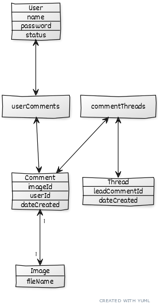

Tietokantakaavio alla

Tietokanta ei ole täysin normailisoitu. 

Thread-taulun account_id-sarake on duplikaatti Comment-taulun account_id:stä. 
Ketjun tekijän saisi selville hakemalla ketjun vanhimman kommentin account_id-kenttää. 
Päätin kuitenkin lisätä account_id-sarakkeen Thread-tauluun helpottamaan tietokantahakuja tapauksissa, joissa täytyy löytää tietyn käyttäjän tekemät ketjut.

Lisäksi monessa taulussa ei ole tapaa päivittää niiden tietoja, jolloin DATE_MODIFIED-sarake jää kopioksi DATE_CREATED-sarakkeesta.
Tämä on seuraus Base-tyypin käytöstä, johon DATE_MODIFIED kuuluu. Tämä on jätetty tauluun tulevaisuuden varalta, mikäli tauluihin jatkokehityksessä tulisi jotakin päivitettävää.